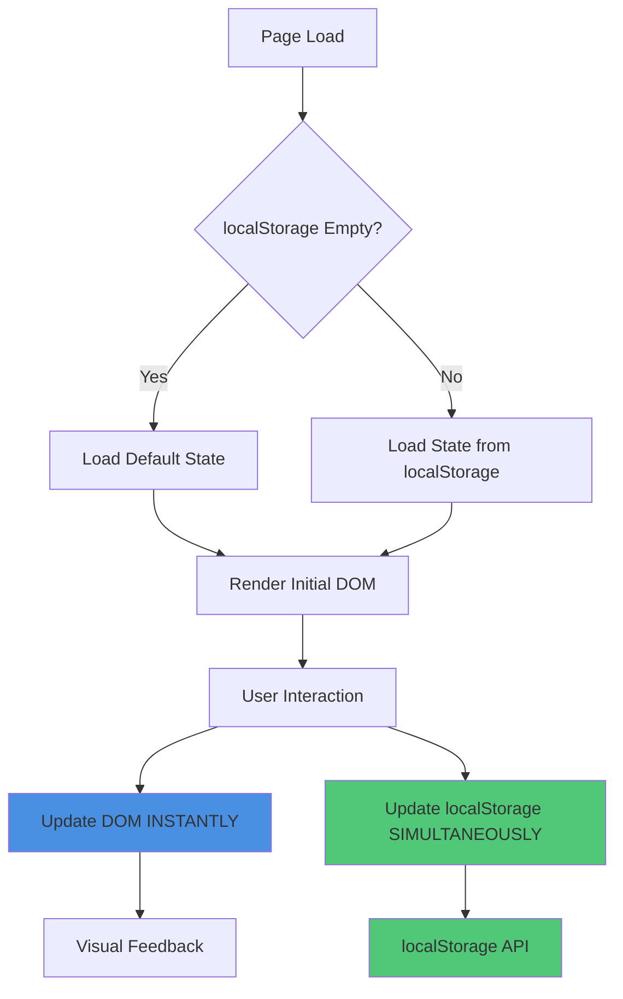
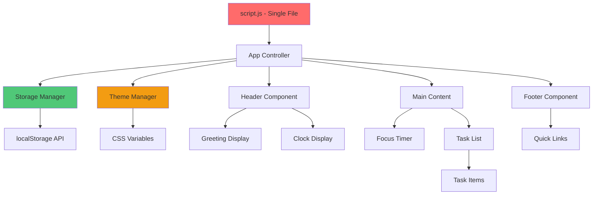

# Design Document: To-Do List Dashboard

## Overview

The To-Do List Dashboard is a single-page web application built with vanilla HTML, CSS, and JavaScript that provides task management, focus timing, and quick links functionality. The application is designed to be completely standalone, requiring no backend server or build tools, and can be used by simply opening the HTML file in a modern browser.

### Design Goals

1. **Simplicity**: Use only vanilla HTML, CSS, and JavaScript to ensure zero dependencies and maximum portability
2. **Standalone Operation**: All functionality runs entirely in the browser with no server required
3. **Data Persistence**: Leverage browser Local Storage API for client-side data persistence
4. **Modularity**: Organize code into logical components with clear separation of concerns
5. **Performance**: Ensure fast load times and responsive UI updates
6. **Accessibility**: Support theme toggling for different lighting conditions

### Technology Stack

- **HTML5**: Semantic markup for structure (single index.html file)
- **CSS3**: Styling with custom properties for theming (single style.css file)
- **Vanilla JavaScript (ES6+)**: All application logic and DOM manipulation (single script.js file)
- **Local Storage API**: Client-side data persistence
- **No build tools**: Direct browser execution

### File Structure (STRICT REQUIREMENT)

```
project-root/
├── index.html          (Main HTML file at root)
├── css/
│   └── style.css       (ONLY 1 CSS FILE - all styles)
└── js/
    └── script.js       (ONLY 1 JAVASCRIPT FILE - all components and logic)
```

**Critical Constraints**:
- All JavaScript code MUST be in a single `script.js` file
- All CSS styling MUST be in a single `style.css` file
- No multiple component files allowed
- All components are defined within the single JavaScript file

## Architecture

The application follows a localStorage-first architecture with a single-file JavaScript implementation. All components, state management, and data persistence logic are contained within one `script.js` file for maximum simplicity and portability.

### Data Flow Architecture



### Component Architecture (Single File)



### Component Hierarchy

```
App Controller
├── Theme Manager
├── Storage Manager
├── Header Component
│   ├── Greeting Display
│   └── Clock Display
├── Main Content Area
│   ├── Focus Timer Component
│   └── Task List Component
│       └── Task Item Components (dynamic)
└── Footer Component
    └── Quick Links
```

### Architectural Patterns

1. **Single-File Component Pattern**: All components are classes/functions defined in one `script.js` file with clear separation through code organization
2. **localStorage-First Data Flow**: 
   - On load: Read entire state from localStorage → Render DOM
   - On change: Update DOM instantly + Update localStorage simultaneously
3. **Observer Pattern**: Components subscribe to state changes and update accordingly
4. **Single Source of Truth**: localStorage is the authoritative data source; all state is loaded from and saved to localStorage
5. **Separation of Concerns Within Single File**:
   - **Presentation Layer**: HTML structure and CSS styling (separate files)
   - **Application Layer**: JavaScript components and business logic (single script.js)
   - **Data Layer**: Storage Manager functions and localStorage interactions (within script.js)

### localStorage-First Data Flow (CRITICAL)

**Initial Load Sequence**:
1. Page loads, `script.js` executes
2. Storage Manager reads ALL configuration data from localStorage
3. If localStorage is empty → Load default state (empty task list, default theme, default timer duration)
4. Render entire DOM based on loaded state

**Update Sequence** (Every user action):
1. User performs action (add task, toggle completion, change theme, set timer)
2. JavaScript updates DOM **INSTANTLY** (visual feedback)
3. JavaScript updates localStorage **SIMULTANEOUSLY** (data persistence)
4. No delay between DOM update and localStorage save

**Example Flow - Adding a Task**:
```javascript
function addTask(description) {
  // 1. Create task object
  const task = new Task(description);
  
  // 2. Update DOM INSTANTLY
  renderTaskElement(task);
  
  // 3. Update localStorage SIMULTANEOUSLY
  const tasks = StorageManager.getTasks();
  tasks.push(task);
  StorageManager.saveTasks(tasks);
  
  // 4. Clear input
  clearTaskInput();
}
```

## Components and Interfaces

**Note**: All components below are defined within the single `script.js` file. They are organized as classes and functions within that file, not as separate files.

### File Organization Within script.js

```javascript
// ============================================
// SECTION 1: Data Models
// ============================================
class Task { ... }
class ThemeState { ... }
class TimerState { ... }

// ============================================
// SECTION 2: Storage Manager
// ============================================
const StorageManager = { ... }

// ============================================
// SECTION 3: Theme Manager
// ============================================
class ThemeManager { ... }

// ============================================
// SECTION 4: Components
// ============================================
class HeaderComponent { ... }
class FocusTimer { ... }
class TaskList { ... }
class TaskItem { ... }
class FooterComponent { ... }

// ============================================
// SECTION 5: App Controller
// ============================================
class AppController { ... }

// ============================================
// SECTION 6: Initialization
// ============================================
document.addEventListener('DOMContentLoaded', () => {
  const app = new AppController();
  app.init();
});
```

### 1. App Controller

**Responsibility**: Orchestrates application initialization and coordinates between components

**Interface**:
```javascript
class AppController {
  constructor()
  init()
  setupEventListeners()
}
```

**Key Functions**:
- Initialize all components on page load
- Load state from localStorage first, then render DOM
- Coordinate communication between components
- Setup global event listeners
- Handle application-level state

**Initialization Sequence**:
```javascript
init() {
  // 1. Load theme from localStorage and apply
  this.themeManager.init();
  
  // 2. Load tasks from localStorage
  this.taskList.loadTasks();
  
  // 3. Initialize header (greeting and clock)
  this.header.init();
  
  // 4. Initialize focus timer with saved duration
  this.focusTimer.init();
  
  // 5. Initialize footer with quick links
  this.footer.init();
  
  // 6. Setup event listeners
  this.setupEventListeners();
}
```

### 2. Storage Manager

**Responsibility**: Manages all localStorage interactions and provides data persistence interface. Implements localStorage-first data flow.

**Interface**:
```javascript
const StorageManager = {
  KEYS: {
    TASKS: 'todo_tasks',
    THEME: 'todo_theme',
    TIMER_DURATION: 'focus_timer_duration'
  },
  
  // Task operations (localStorage-first)
  getTasks: function(): Task[],          // Load from localStorage
  saveTasks: function(tasks: Task[]): void,  // Save to localStorage immediately
  addTask: function(task: Task): void,   // Add and save immediately
  updateTask: function(taskId: string, updates: Partial<Task>): void,  // Update and save immediately
  deleteTask: function(taskId: string): void,  // Delete and save immediately
  
  // Settings operations (localStorage-first)
  getTheme: function(): string,          // Load from localStorage
  saveTheme: function(theme: string): void,  // Save to localStorage immediately
  getTimerDuration: function(): number,  // Load from localStorage
  saveTimerDuration: function(duration: number): void  // Save to localStorage immediately
}
```

**localStorage-First Implementation Pattern**:
```javascript
// Every save operation writes to localStorage IMMEDIATELY
saveTasks(tasks) {
  try {
    const json = JSON.stringify(tasks);
    localStorage.setItem(this.KEYS.TASKS, json);
  } catch (e) {
    console.error('Failed to save tasks:', e);
    // Handle quota exceeded or other errors
  }
}

// Every get operation reads from localStorage FIRST
getTasks() {
  try {
    const json = localStorage.getItem(this.KEYS.TASKS);
    if (!json) return [];  // Default if empty
    return JSON.parse(json);
  } catch (e) {
    console.error('Failed to load tasks:', e);
    return [];  // Fallback to empty array
  }
}
```

**Storage Format**:
```javascript
// localStorage structure
{
  "todo_tasks": "[{\"id\":\"uuid\",\"description\":\"Task text\",\"completed\":false,\"createdAt\":1234567890}]",
  "todo_theme": "light",
  "focus_timer_duration": 1500
}
```

**Data Flow for Task Operations**:
```javascript
// Example: Adding a task (DOM + localStorage update together)
function addTaskToSystem(description) {
  const task = new Task(description);
  
  // Step 1: Update DOM instantly
  appendTaskToDOM(task);
  
  // Step 2: Update localStorage simultaneously
  const tasks = StorageManager.getTasks();
  tasks.push(task);
  StorageManager.saveTasks(tasks);  // Immediate save
}
```

### 3. Theme Manager

**Responsibility**: Handles theme switching and applies CSS variable updates. Implements localStorage-first theme loading.

**Interface**:
```javascript
class ThemeManager {
  constructor()
  init(): void                    // Load theme from localStorage, apply to DOM
  toggleTheme(): void             // Toggle and save immediately
  applyTheme(themeName: string): void  // Apply CSS variables
  getCurrentTheme(): string       // Get current theme from DOM or localStorage
}
```

**localStorage-First Theme Flow**:
```javascript
init() {
  // 1. Load theme from localStorage FIRST
  const savedTheme = StorageManager.getTheme();
  
  // 2. Apply loaded theme to DOM
  this.applyTheme(savedTheme);
}

toggleTheme() {
  const current = this.getCurrentTheme();
  const newTheme = current === 'light' ? 'dark' : 'light';
  
  // 1. Apply to DOM INSTANTLY
  this.applyTheme(newTheme);
  
  // 2. Save to localStorage SIMULTANEOUSLY
  StorageManager.saveTheme(newTheme);
}
```

**CSS Variables Structure**:
```css
:root {
  /* Light theme (default) */
  --bg-primary: #ffffff;
  --bg-secondary: #f5f5f5;
  --text-primary: #333333;
  --text-secondary: #666666;
  --accent-color: #4a90e2;
  --border-color: #dddddd;
}

[data-theme="dark"] {
  --bg-primary: #1e1e1e;
  --bg-secondary: #2d2d2d;
  --text-primary: #ffffff;
  --text-secondary: #b0b0b0;
  --accent-color: #64b5f6;
  --border-color: #404040;
}
```

### 4. Header Component

**Responsibility**: Displays greeting and live clock

**Interface**:
```javascript
class HeaderComponent {
  constructor()
  init(): void
  updateGreeting(): void
  updateClock(): void
  getTimeBasedGreeting(): string
}
```

**Time-Based Greetings**:
- 05:00-11:59: "Good morning"
- 12:00-17:59: "Good afternoon"
- 18:00-04:59: "Good evening"

**Clock Update**: Uses `setInterval` to update every 1000ms

### 5. Focus Timer Component

**Responsibility**: Provides countdown timer functionality for focus sessions with localStorage persistence

**Interface**:
```javascript
class FocusTimer {
  constructor()
  init(): void                           // Load saved duration from localStorage
  start(): void                          // Start countdown
  pause(): void                          // Pause countdown
  reset(): void                          // Reset to saved duration
  setDuration(minutes: number): void     // Set duration and save to localStorage
  onComplete(): void                     // Handle timer completion
  updateDisplay(): void                  // Update DOM with current time
  formatTime(seconds: number): string    // Format seconds to MM:SS
}
```

**State**:
```javascript
{
  duration: number,        // Total duration in seconds (loaded from localStorage)
  remaining: number,       // Remaining time in seconds
  isRunning: boolean,      // Timer active state
  intervalId: number | null // setInterval reference
}
```

**localStorage Integration**:
```javascript
init() {
  // Load saved duration from localStorage
  this.duration = StorageManager.getTimerDuration() || 1500;
  this.remaining = this.duration;
  this.updateDisplay();
}

setDuration(minutes) {
  const seconds = minutes * 60;
  this.duration = seconds;
  this.remaining = seconds;
  
  // Save to localStorage immediately
  StorageManager.saveTimerDuration(seconds);
  
  this.updateDisplay();
}
```

**Timer Logic**:
- Duration stored in seconds
- Countdown decrements every 1000ms
- Alerts user when timer reaches zero
- Persists custom duration to Local Storage

### 6. Task List Component

**Responsibility**: Manages the collection of task items with localStorage-first data flow

**Interface**:
```javascript
class TaskList {
  constructor()
  init(): void                                    // Load tasks from localStorage and render
  loadTasks(): void                               // Load from localStorage
  addTask(description: string): void              // Add task (DOM + localStorage)
  renderTasks(): void                             // Render all tasks to DOM
  clearInput(): void                              // Clear input field
  handleTaskUpdate(taskId: string, completed: boolean): void  // Update (DOM + localStorage)
  handleTaskDelete(taskId: string): void          // Delete (DOM + localStorage)
}
```

**State**:
```javascript
{
  tasks: Task[]  // Array of task objects (loaded from localStorage)
}
```

**localStorage-First Implementation**:
```javascript
// On page load: Load from localStorage FIRST
init() {
  this.loadTasks();
  this.renderTasks();
  this.setupEventListeners();
}

loadTasks() {
  // Load from localStorage
  this.tasks = StorageManager.getTasks();
}

// On user action: Update DOM + localStorage together
addTask(description) {
  if (!this.isValid(description)) return;
  
  const task = new Task(description);
  
  // 1. Update DOM instantly
  this.appendTaskToDOM(task);
  
  // 2. Update internal state
  this.tasks.push(task);
  
  // 3. Save to localStorage simultaneously
  StorageManager.saveTasks(this.tasks);
  
  // 4. Clear input
  this.clearInput();
}

handleTaskUpdate(taskId, completed) {
  // 1. Update DOM instantly
  this.updateTaskDOM(taskId, completed);
  
  // 2. Update internal state
  const task = this.tasks.find(t => t.id === taskId);
  task.completed = completed;
  
  // 3. Save to localStorage simultaneously
  StorageManager.saveTasks(this.tasks);
}

handleTaskDelete(taskId) {
  // 1. Remove from DOM instantly
  this.removeTaskFromDOM(taskId);
  
  // 2. Update internal state
  this.tasks = this.tasks.filter(t => t.id !== taskId);
  
  // 3. Save to localStorage simultaneously
  StorageManager.saveTasks(this.tasks);
}
```

### 7. Task Item Component

**Responsibility**: Represents individual task with completion tracking and deletion

**Interface**:
```javascript
class TaskItem {
  constructor(task: Task)
  render(): HTMLElement
  toggleComplete(): void
  delete(): void
  updateDisplay(): void
}
```

**Task Structure**:
```javascript
{
  id: string,           // UUID for unique identification
  description: string,  // Task text
  completed: boolean,   // Completion status
  createdAt: number     // Unix timestamp
}
```

### 8. Footer Component

**Responsibility**: Displays quick links for navigation

**Interface**:
```javascript
class FooterComponent {
  constructor(links: QuickLink[])
  init(): void
  render(): void
}
```

**Quick Link Structure**:
```javascript
{
  text: string,
  url: string,
  openInNewTab: boolean
}
```

## Data Models

### Task Model

```javascript
class Task {
  id: string              // UUID generated on creation
  description: string     // Task text (max 500 characters)
  completed: boolean      // Default: false
  createdAt: number       // Unix timestamp (milliseconds)
  
  constructor(description: string)
  toJSON(): string
  static fromJSON(json: string): Task
  static generateId(): string
}
```

**Validation Rules**:
- `description`: Non-empty string, trimmed, 1-500 characters
- `completed`: Boolean value only
- `id`: Must be unique UUID format
- `createdAt`: Must be valid Unix timestamp

### Theme State Model

```javascript
class ThemeState {
  current: 'light' | 'dark'  // Current active theme
  
  static DEFAULT = 'light'
  static VALID_THEMES = ['light', 'dark']
  
  static isValid(theme: string): boolean
}
```

### Timer State Model

```javascript
class TimerState {
  duration: number        // Total duration in seconds (default: 1500)
  remaining: number       // Remaining time in seconds
  isRunning: boolean      // Timer active state
  
  static DEFAULT_DURATION = 1500  // 25 minutes
  static MIN_DURATION = 60        // 1 minute
  static MAX_DURATION = 7200      // 2 hours
}
```

## Error Handling

### localStorage Error Handling

```javascript
// Graceful degradation when localStorage is unavailable
const StorageManager = {
  isAvailable: true,
  memoryStorage: {},  // Fallback in-memory storage
  
  init() {
    try {
      localStorage.setItem('test', 'test');
      localStorage.removeItem('test');
      this.isAvailable = true;
    } catch (e) {
      console.warn('localStorage not available, using in-memory storage');
      this.isAvailable = false;
    }
  },
  
  // All storage methods check availability first
  getTasks() {
    if (!this.isAvailable) {
      return this.memoryStorage.tasks || [];
    }
    try {
      const json = localStorage.getItem(this.KEYS.TASKS);
      return json ? JSON.parse(json) : [];
    } catch (e) {
      console.error('Failed to load tasks:', e);
      return [];
    }
  },
  
  saveTasks(tasks) {
    if (!this.isAvailable) {
      this.memoryStorage.tasks = tasks;
      return;
    }
    try {
      localStorage.setItem(this.KEYS.TASKS, JSON.stringify(tasks));
    } catch (e) {
      if (e.name === 'QuotaExceededError') {
        console.error('localStorage quota exceeded');
        // Could clear old tasks or notify user
      } else {
        console.error('Failed to save tasks:', e);
      }
    }
  }
}
```

**Error Scenarios**:
1. **Quota Exceeded**: Clear old tasks or notify user that storage is full
2. **Storage Unavailable**: Fall back to in-memory storage (session-only, lost on reload)
3. **Corrupted Data**: Log error, clear corrupted entry, and use default values
4. **Parse Errors**: Log error and return default empty state

**Critical Rule**: Every localStorage write operation MUST handle errors gracefully without breaking the user experience. If save fails, the DOM update should still succeed (optimistic UI).

### Input Validation Errors

- **Empty Task Description**: Display inline error message, prevent submission
- **Invalid Timer Duration**: Clamp to valid range (1-120 minutes)
- **Invalid Theme Value**: Fall back to default theme

### User Feedback

- **Visual Feedback**: Disable buttons during operations, show loading states
- **Error Messages**: Display user-friendly error messages for failures
- **Success Indicators**: Brief visual confirmation for successful actions

## Testing Strategy

This feature is suitable for property-based testing as it involves:
- Pure functions for data transformation (JSON serialization/deserialization)
- State management with clear input/output behavior
- UI interactions with testable properties
- localStorage-first data flow with round-trip properties

**Implementation Note**: All code is in a single `script.js` file, but tests can still be organized by testing different classes/functions within that file.

### Unit Testing Approach

**Unit tests should focus on**:
- Storage Manager serialization/deserialization
- Task model validation
- Timer countdown logic
- Theme toggle state transitions
- Input validation edge cases
- Specific UI interaction examples
- localStorage save/load operations

**Example unit tests**:
- Empty task input validation blocks task creation
- Timer reaches zero triggers alert
- Theme toggle switches between light and dark
- Task deletion removes item from list
- localStorage save operation handles quota exceeded error
- Task list loads correctly from localStorage on page load

### Property-Based Testing Approach

Property-based tests will validate universal properties across many generated inputs using a JavaScript PBT library such as **fast-check** (recommended for browser/Node.js compatibility).

**Configuration**:
- Minimum 100 iterations per property test
- Each test tagged with: `Feature: to-do-list-dashboard, Property {number}: {property_text}`

**Property tests should verify**:
- Round-trip properties (serialization/deserialization)
- State invariants maintained across operations
- UI state consistency with data model
- Theme application completeness

### Integration Testing

- Full task lifecycle (create, complete, delete, persist, reload)
- localStorage-first flow: Page load → Read state → Render → User action → Update DOM + localStorage
- Timer with task workflow
- Theme persistence across page reloads
- Multiple tasks with various states
- localStorage error handling (quota exceeded, unavailable)
- Fallback to in-memory storage when localStorage is unavailable

### Browser Compatibility Testing

- Manual testing on Chrome, Firefox, Edge, Safari
- Verify localStorage functionality across browsers
- Verify CSS custom properties support
- Verify ES6+ JavaScript features
- Test single-file structure loads correctly in all browsers

### Performance Testing

- Task list rendering with 100+ items
- Timer precision over long durations
- Theme toggle responsiveness
- localStorage read/write performance
- Page load time with large localStorage data
- DOM update performance (instant visual feedback requirement)


## Correctness Properties

*A property is a characteristic or behavior that should hold true across all valid executions of a system—essentially, a formal statement about what the system should do. Properties serve as the bridge between human-readable specifications and machine-verifiable correctness guarantees.*

The following properties define universal behaviors that must hold across all valid inputs and states of the To-Do List Dashboard. Each property will be implemented as a property-based test using **fast-check** library with minimum 100 iterations.

### Property 1: Time-Based Greeting Accuracy

*For any* valid hour value (0-23), the greeting function SHALL return "Good morning" for hours 5-11, "Good afternoon" for hours 12-17, and "Good evening" for hours 18-4.

**Validates: Requirements 2.2**

### Property 2: Time Formatting Consistency

*For any* valid timestamp, the time formatting function SHALL produce a readable string in HH:MM format (with optional AM/PM for 12-hour format) that can be parsed back to the original hour and minute values.

**Validates: Requirements 3.3**

### Property 3: Timer Pause Preservation

*For any* valid remaining time value on the focus timer, pausing the timer SHALL preserve the exact remaining time value without decrement.

**Validates: Requirements 4.3**

### Property 4: Timer Reset Idempotence

*For any* valid initial timer duration, performing a start-pause-reset sequence SHALL return the timer to the exact initial duration regardless of how much time elapsed.

**Validates: Requirements 4.4**

### Property 5: Custom Timer Duration Acceptance

*For any* valid duration value between 60 and 7200 seconds, setting the timer duration SHALL accept the value and display it correctly as the timer's starting point.

**Validates: Requirements 4.6**

### Property 6: Task Creation Adds to List

*For any* valid (non-empty, non-whitespace) task description, creating a task SHALL result in the task list length increasing by exactly one and the new task appearing in the rendered task list.

**Validates: Requirements 5.2, 5.3**

### Property 7: Whitespace Validation Blocks Creation

*For any* string composed entirely of whitespace characters (spaces, tabs, newlines) or empty string, attempting to create a task SHALL be blocked, the task list SHALL remain unchanged, and the list length SHALL not increase.

**Validates: Requirements 5.4**

### Property 8: Input Field Cleared After Creation

*For any* valid task description, after successfully creating the task, the input field SHALL contain an empty string.

**Validates: Requirements 5.5**

### Property 9: Task Completion Toggle

*For any* task in the task list, toggling the completion status SHALL flip the boolean completed value, and toggling again SHALL return it to the original state. Additionally, when completed is true, the rendered task element SHALL have visual completion styling (CSS class or inline style).

**Validates: Requirements 6.2, 6.3, 6.4**

### Property 10: Task Deletion Removes from List and Storage

*For any* task in the task list, deleting the task SHALL remove it from both the rendered UI list and from Local Storage, such that the task no longer appears in either location.

**Validates: Requirements 7.2, 7.3, 8.3**

### Property 11: Task Modification Updates Storage

*For any* task in the task list, modifying its completion status SHALL immediately update the corresponding task object in Local Storage with the new completion value.

**Validates: Requirements 8.2**

### Property 12: Task Persistence Round-Trip (PRIMARY)

*For any* valid task object (with any description, completion status, and timestamp), serializing the task to JSON and storing it in Local Storage, then retrieving and deserializing it, SHALL produce a task object with identical id, description, completed, and createdAt values.

**Validates: Requirements 8.1, 8.4, 8.7**

**Note**: This is the primary persistence property that ensures data integrity across page reloads. It subsumes individual save and load operations.

### Property 13: Theme Persistence Round-Trip

*For any* valid theme state ('light' or 'dark'), setting the theme, saving it to Local Storage, then retrieving it on application reload SHALL restore the exact same theme state.

**Validates: Requirements 8.5, 8.6, 9.4**

### Property 14: Theme Toggle Idempotence

*For any* starting theme state, toggling the theme twice SHALL return the application to the original theme state (light → dark → light, or dark → light → dark).

**Validates: Requirements 9.1**

### Property 15: Theme Application Completeness

*For any* theme change, all component root elements in the DOM SHALL have the correct `data-theme` attribute value matching the new theme state.

**Validates: Requirements 9.2**

### Property 16: Theme CSS Variable Correctness

*For any* theme state, the computed CSS custom property values (--bg-primary, --bg-secondary, --text-primary, --text-secondary, --accent-color, --border-color) SHALL match the expected values defined in the theme's CSS rule set.

**Validates: Requirements 9.3**

